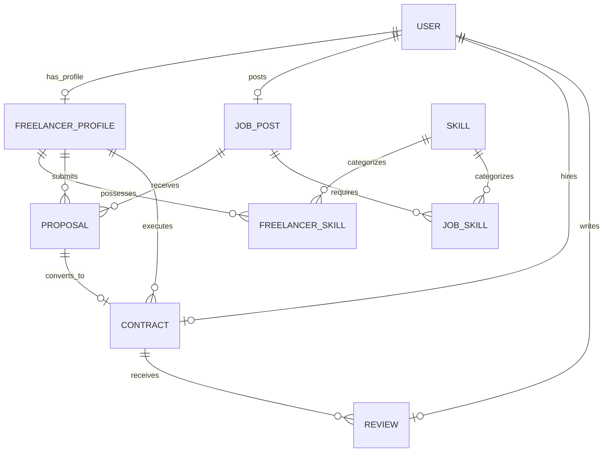

# FreelanceHub - Database Plan

This document outlines the database design, the relationship between MySQL and Prisma ORM, the initial step configurations, and the planned schemas for future modules.

---

## 1. Core Database Architecture
FreelanceHub uses a modern, relational database configuration:

### The Relational Database: MySQL
- **Role:** Actual data persistence engine.
- **Details:** Runs as a standalone server or cloud container instance. It holds the tables, primary/foreign key indexes, triggers, and executes query optimizations. It is the single source of truth for the system state.

### The ORM / Database Toolkit: Prisma
- **Role:** Database client, migration tool, and schema architect.
- **Details:** Prisma is **not** a database. It is a toolkit used by Node.js to bridge JavaScript and SQL. It consists of:
  - **Prisma Schema (`schema.prisma`):** A declarative configuration file defining database connections and entity relationships.
  - **Prisma Client:** An auto-generated query builder that provides type-safe access to MySQL from Node.js code.
  - **Prisma Migrate:** A migration tool that tracks schema modifications and generates SQL migration files automatically.

---

## 2. Schema Scaffolding (Step 0)
For Step 0, we avoid loading the database with complex relational models. The database architecture is configured in `server/prisma/schema.prisma` with:
- **Datasource:** Configured to use the `mysql` provider.
- **Generator:** Configured to generate the `prisma-client-js`.
- **A Single Placeholder Model:** To compile and validate successfully.

---

## 3. Relational Schema Blueprint (Future Modules)
In future steps (Step 1 and onwards), the schema will expand to include several relational entities. Below is the blueprint of models and their relationships:

### Future Relational Entities

### Relational Model Definitions

1. **User (Account Level)**
   - Fields: `id`, `email`, `passwordHash`, `role` (CUSTOMER, FREELANCER, ADMIN), `createdAt`, `updatedAt`.
   - Links: One-to-One with Freelancer Profile, One-to-Many with Job Posts (as Client/Customer), One-to-Many with Contracts.

2. **Freelancer Profile**
   - Fields: `id`, `userId` (FK to User), `title`, `bio`, `hourlyRate`, `location`, `rating`.
   - Links: One-to-Many with Freelancer-Skill maps, One-to-Many with Proposals, One-to-Many with Contracts.

3. **Skills & Mappings**
   - Entities: `Skill` (lookup table), `FreelancerSkill` (bridge table), `JobSkill` (bridge table).
   - Relations: Maps skill sets to freelancers and requirements to job postings.

4. **Job Postings**
   - Fields: `id`, `customerId` (FK to User), `title`, `description`, `budget`, `type` (FIXED or HOURLY), `status` (OPEN, IN_PROGRESS, CLOSED, ARCHIVED).
   - Links: One-to-Many with Proposals, One-to-Many with Job-Skill maps.

5. **Proposals**
   - Fields: `id`, `jobId` (FK to JobPost), `freelancerId` (FK to FreelancerProfile), `coverLetter`, `bidAmount`, `status` (PENDING, ACCEPTED, DECLINED).
   - Links: One-to-One with Contracts.

6. **Contracts & Projects**
   - Fields: `id`, `jobId` (FK to JobPost), `customerId` (FK to User), `freelancerId` (FK to FreelancerProfile), `agreedBudget`, `status` (ACTIVE, COMPLETED, DISPUTED, CANCELLED), `createdAt`.
   - Links: One-to-Many with Reviews and Ratings.

7. **Reviews & Ratings**
   - Fields: `id`, `contractId` (FK to Contract), `reviewerId` (FK to User), `revieweeId` (FK to User), `rating` (1-5), `comment`.
